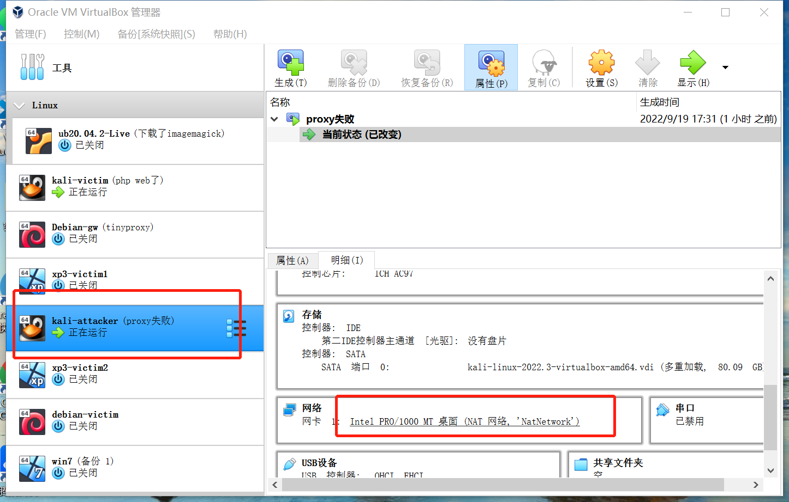
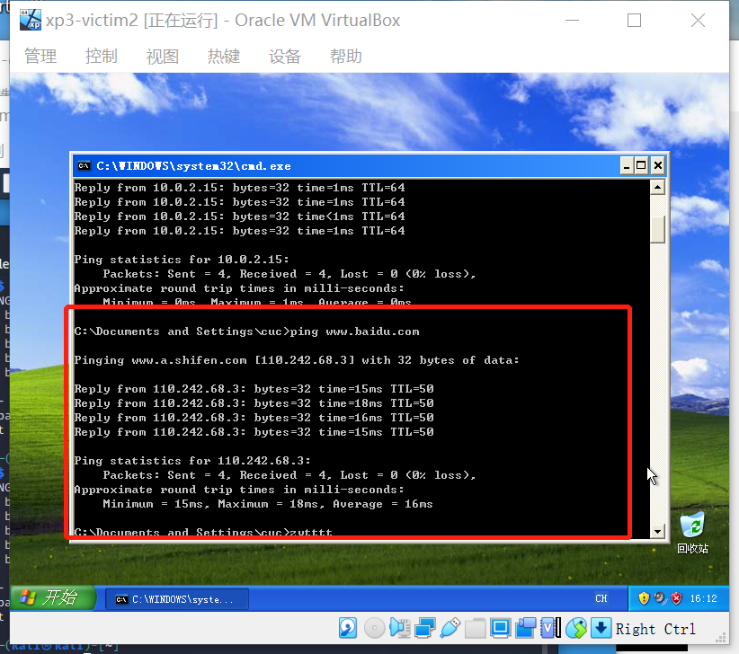

# 基于 VirtualBox 的网络攻防基础环境搭建

## 实验目的

- 掌握 VirtualBox 虚拟机的安装与使用；
- 掌握 VirtualBox 的虚拟网络类型和按需配置；
- 掌握 VirtualBox 的虚拟硬盘多重加载；

## 实验要求
- [x] 虚拟硬盘配置成多重加载；
- [x] 搭建满足如下拓扑图所示的虚拟机网络拓扑；

- [x] 完成以下网络连通性测试；
    - [x] 靶机可以直接访问攻击者主机
    - [x] 攻击者主机无法直接访问靶机
    - [x] 网关可以直接访问攻击者主机和靶机
    - [x] 靶机的所有对外上下行流量必须经过网关
    - [x] 所有节点均可以访问互联网

## 实验环境
**1.虚拟机**
- 攻击者主机（Attacker）：kali-attacker
- 网关（Gateway, GW）：Debian-gw
- 靶机（Victim）：
    - intnet1:
    kali-victim;xp3-victim1
    - intnet2:
    debian-victim;xp3-victim2

**2.网络配置**

* 网关网卡配置：
 

* 攻击者主机配置：
 

* 靶机debian-victim配置：
 

* 靶机kali-victim配置：
 

* 靶机xp3-victim1配置：
 

* 靶机xp3-victim2配置：
 

注意：此处修改xp系统控制芯片为：PCnet-FAST III。
 

**3.虚拟机ip地址**

|      名称      |       ip地址       |
| :------------: | :---------------: |
|   Debian-gw    |   10.0.2.4/24    |
|                | 169.254.63.218/16 |
|                |  172.16.111.1/24  |
|                |  172.16.222.1/24  |
| kali-attacker  |   10.0.2.15/24    |
|  kali-victim   | 172.16.111.144/24 |
|  xp3-victim1   | 172.16.111.134/24 |
|  xp3-victim2   | 172.16.222.148/24 |
| debian-victim  | 172.16.222.149/24 |

## 实验要求
### 虚拟硬盘设置多重加载
因事先已经导入了虚拟硬盘，所以首先打开虚拟介质管理，将指定虚拟硬盘设置类型为多重加载： 
 
 
利用多重加载配置虚拟机： 
 

### 网络拓扑图
 

### 网络连通性测试

**靶机可以直接访问攻击者主机** 

debian-victim靶机访问攻击者主机：
 
kali-victim靶机访问攻击者主机：
 
xp3-victim1靶机访问攻击者主机:
 
xp3-victim1靶机访问攻击者主机:
 

**攻击者主机无法直接访问靶机** 
 
 

**网关可以直接访问攻击者主机和靶机** 
网关访问攻击者主机：
 
网关访问debian-victim:
 
网关访问kali-victim:
 
网关访问xp3-victim1:
 
网关访问xp3-victim2:
 

**靶机的所有对外上下行流量必须经过网关** 
通过查看网关的DNS日志记录观察靶机流量是否经过网关：
 
debian-victim上下行流量经过网关：
 
kali-victim上下行流量经过网关：
 
xp3-victim1上下行流量经过网关：
 
xp3-victim2上下行流量经过网关：
 

**所有节点均可以访问互联网** 
通过ping百度网站的方式测试是否能够连接互联网： 
攻击者主机kali-attacker连接互联网：
 
网关Debian-gw连接互联网：

debian-victim连接互联网：
 
kali-victim连接互联网：
 
xp3-victim1连接互联网：
 
xp3-victim2连接互联网：
 

### 遇到问题与解决办法
在网关连接两个xp靶机时最初出现了无法联通的现象： 
 
通过相关资料搜索以及询问，问题在于防火墙，点击右下角windows安全中心，打开windows防火墙里的ICMP设置，允许传入回显请求，最后确定即可。 
 
 

### 参考资料

[2021-ns-public-luminous-123](https://github.com/CUCCS/2021-ns-public-luminous-123/blob/chap0x01/chap0x01/Chap0x01%E5%AE%9E%E9%AA%8C%E6%8A%A5%E5%91%8A.md) 