# HTTP代理服务器实验

## 实验目的
- 在Debian-gw中安装tinyproxy
- 用主机设置浏览器代理指向tinyproxy建立的HTTP正向代理
- 在Kali中用wireshark抓包，分析抓包过程，理解HTTP正向代理HTTPS流量的特点

## 实验过程
**1.准备实验所需要的虚拟机设备**<br/>
|      名称      |       ip地址       |
| :------------: | :---------------: |
|网关|10.0.2.4/24 |
||169.254.63.218/16|
||172.16.111.1/24 |
|攻击者主机|10.0.2.15/24|
|靶机|172.16.111.144/24|

**2.连通性检测**<br/>
由第一章实验同理ping各主机ip地址进行检测
|     |攻击者|网关|靶机|
| :---:| :---:| :---: | :----: |
|攻击者	|-|	√|x|
|网关|√|-|√|
|靶机|√|√|-|

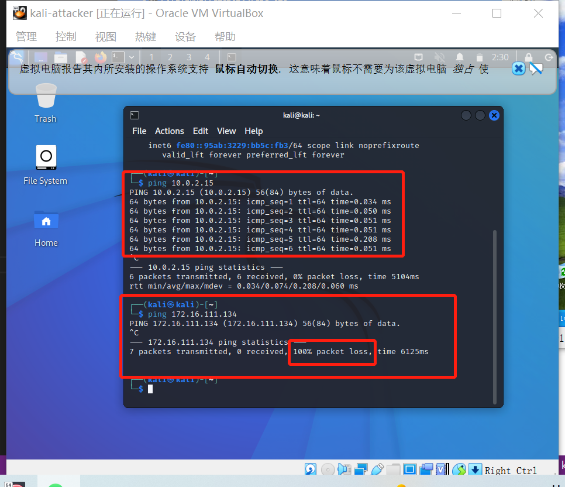<br/>

实验拓扑示意图如下：<br/>
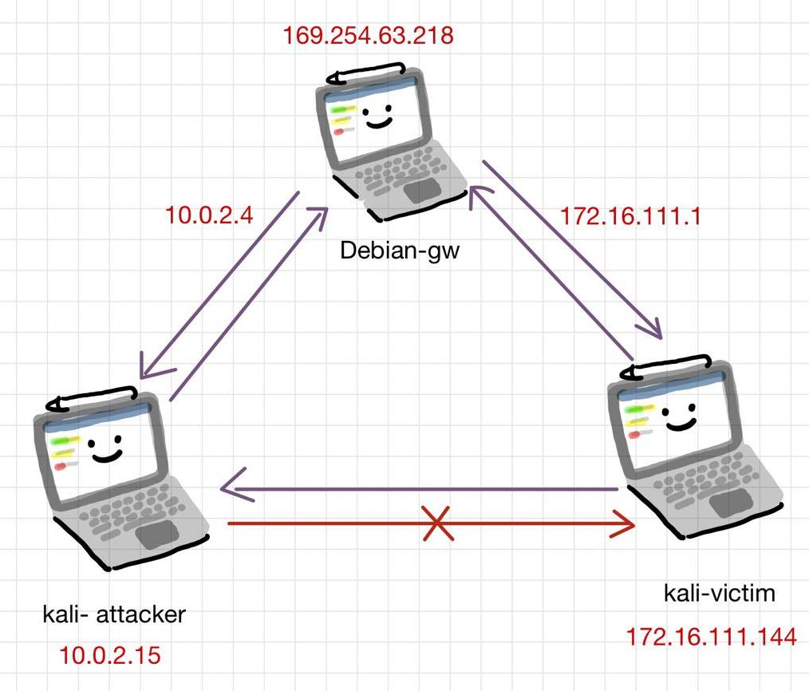<br/>

**3.在网关中安装配置tinyproxy**
```javascript
tinyproxy使用主要注意事项：
apt update
apt install tinyproxy

# 编辑tinyproxy，取消Allow 10.0.0.0/8行首注释
/etc/init.d/tinyproxy start

# 设置虚拟机联网方式为NAT和端口转发，默认tinyproxy监听8888端口
# 主机浏览器设置代理指向tinyproxy的服务地址
# 虚拟机里开启wireshark抓包
# 主机访问https站点
# 结束抓包，分析抓包结果
```

- 下载tinyproxy<br/>
```javascript
apt update
apt install tinyproxy
```
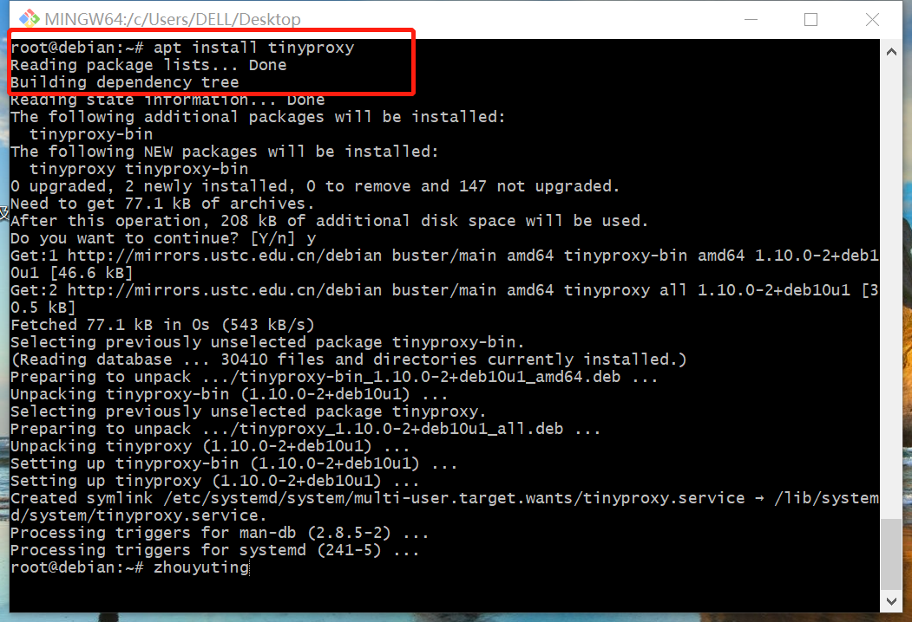<br/>

- 修改tinyproxy配置文件<br/>
```javascript
vim /etc/tinyproxy/tinyproxy.conf
```

设置虚拟机联网方式为NAT和端口转发，允许NAT网络内的节点使用网关的代理服务，默认tinyproxy监听8888端口。<br/>
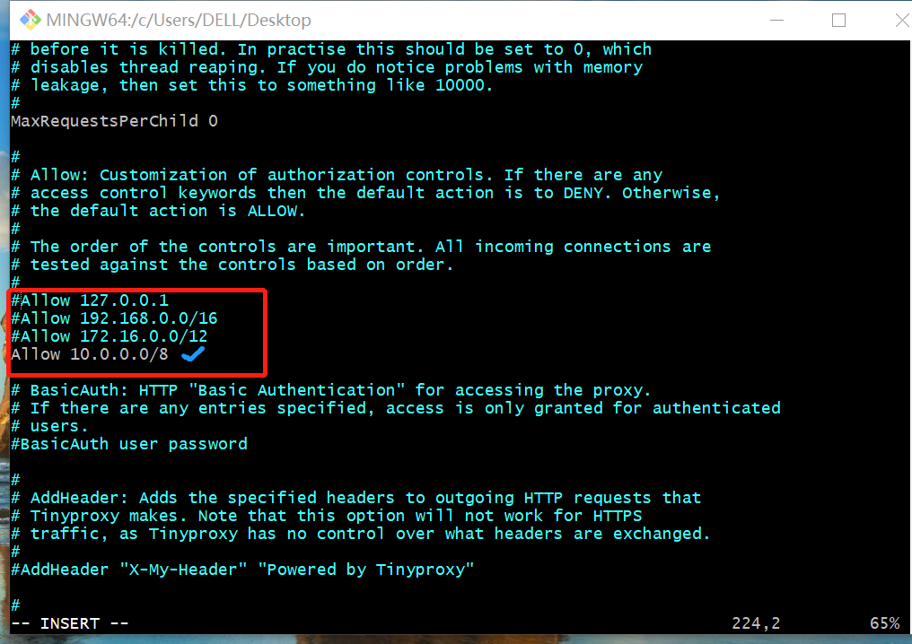<br/>

- 开启tinyproxy服务<br/>
```javascript
systemctl start tinyproxy
#查看tinyproxy服务状态
systemctl status tinyproxy.service
```
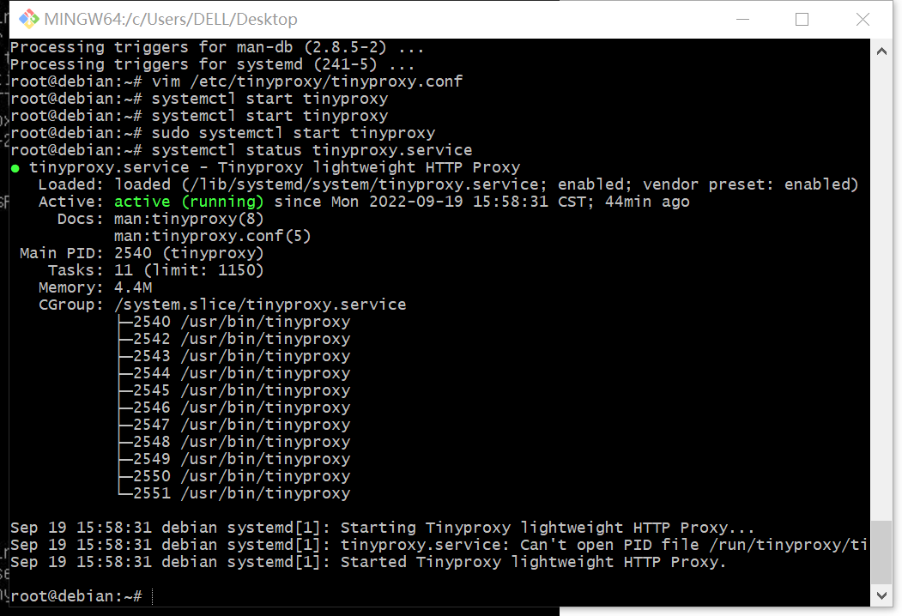<br/>

- 攻击者主机打开Firefox浏览器，进入connections-setting代理设置，填写ip地址和端口号。<br/>
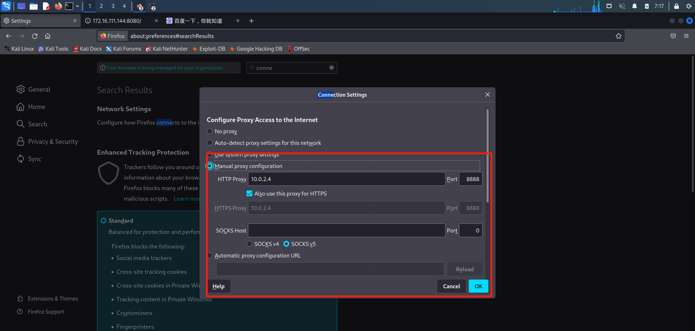<br/>

- 在靶机开启web服务<br/>
```javascript
php -S 0.0.0.0:8080
```

**4.使用tinyproxy访问靶机**

在攻击者的firefox上配置并启用代理服务器后，同时在攻击者、网关、靶机开启抓包。<br/>

1.攻击者主机

- 使用firefox访问靶机172.166.111.144和172.166.111.144/hacking，分别显示Apache默认页面和404页面，没有直接给出代理服务器信息。<br/>
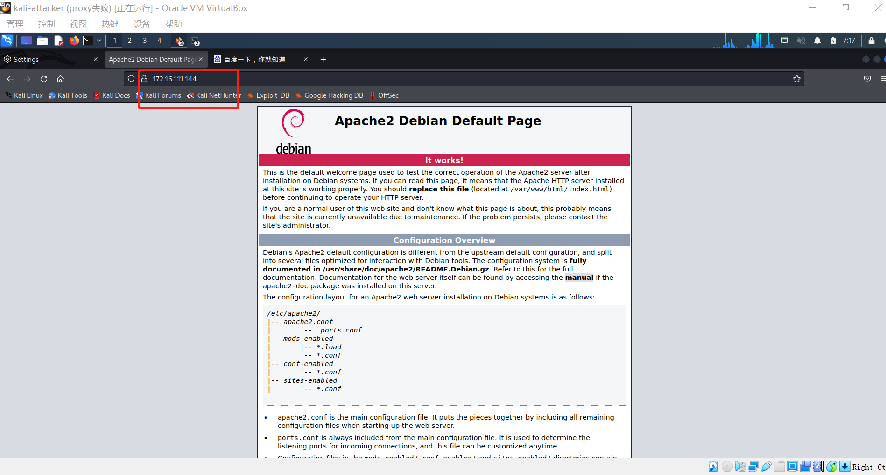<br/>
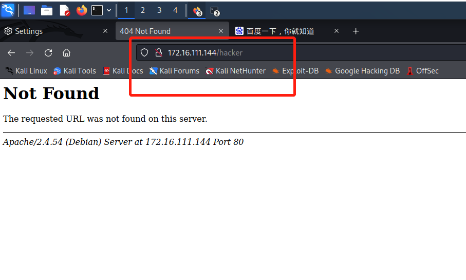<br/>
- 在kali终端输入```wireshark```，选中本地网卡"eth0"，并取消混杂模式。<br/>
<br/>
- 使用wireshark进行抓包分析，抓到相关http包后右键点击选择follow，再选择tcp stream即可查看http响应内容，发现HTTP响应里含有Via: 1.1 tinyproxy (tinyproxy/1.10.0)字段。<br/>

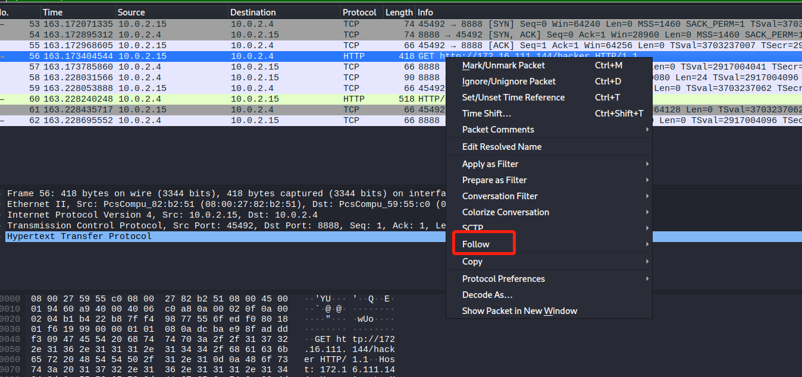<br/>
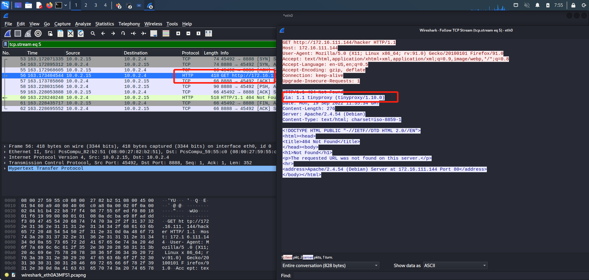<br/>

2.靶机

- 同理使用wireshark进行抓包分析，查看http响应内容，发现HTTP响应里含有Via: 1.1 tinyproxy (tinyproxy/1.10.0)字段。<br/>
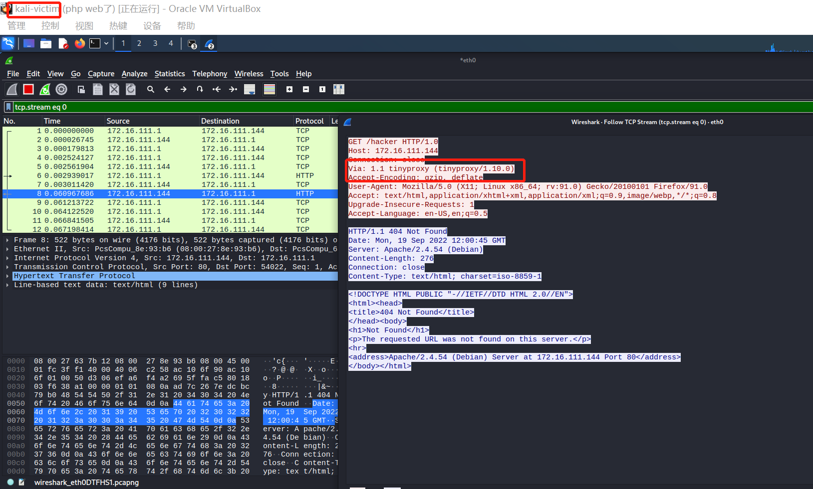<br/>
    - 可以发现HTTP协议中有Via: 1.1 tinyproxy (tinyproxy/1.10.0)字段，说明网关（代理服务器）正在提供代理服务。<br/>
    - 攻击者主机IP地址、以太网接口均未暴露。<br/>

3.网关
- 由于Debian无可视化界面，选择使用```tcpdump -w result.cap```语句将抓包文件保存，然后在kali-victim主机上使用```scp -r root@172.16.111.1:/root/result.cap /home/kali/Desktop/```语句把文件传过来。<br/>
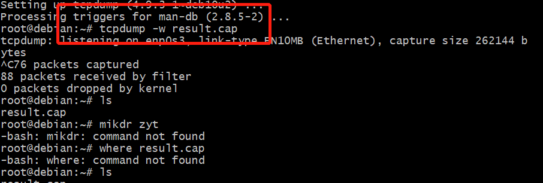<br/>
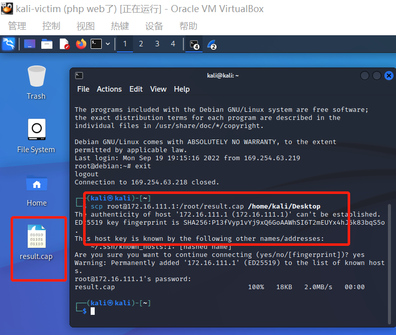<br/>
- 同理使用wireshark查看http响应内容，发现HTTP响应里含有Via: 1.1 tinyproxy (tinyproxy/1.10.0)字段。<br/>
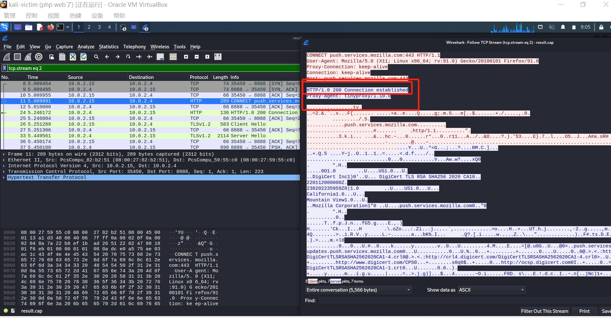<br/>

    - 网关保留HTTP GET请求内容，若攻击者主机（客户端）的浏览器不清除历史记录，则下次访问同样的HTTP服务时用非常短。<br/>

    - 若在网关设置防火墙规则过滤攻击者主机（客户端）发出的的请求，则攻击者主机依然无法访问靶机端的HTTP服务。<br/>

    - 代理层可以理解HTTP报文。<br/>

**6.tinyproxy访问https界面(以百度为例)**
- 在kali-attacker主机上通过火狐访问https://www.baidu.com， 同理在网关Debian-gw上进行抓包，并使用scp语句传至kali-victim主机上进行分析。<br/>
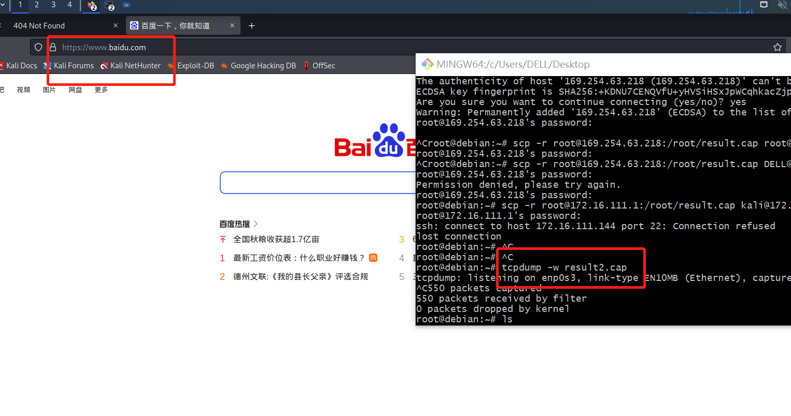<br/>
- 使用https，代理服务器网关可以发现攻击者主机访问的网址，但是看不到具体的传输数据，因为数据已经被加密成乱码。<br/>
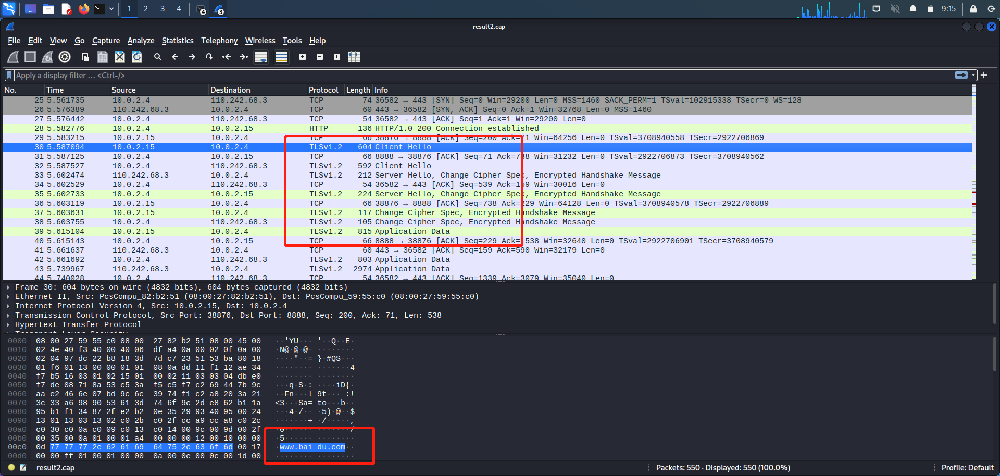<br/>
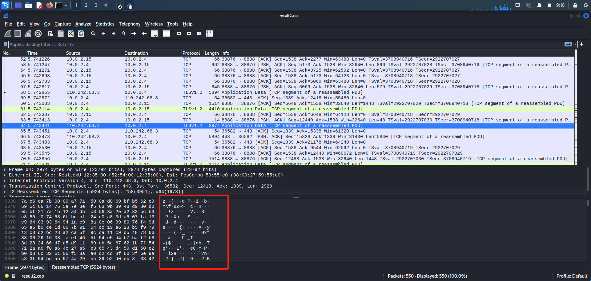<br/>
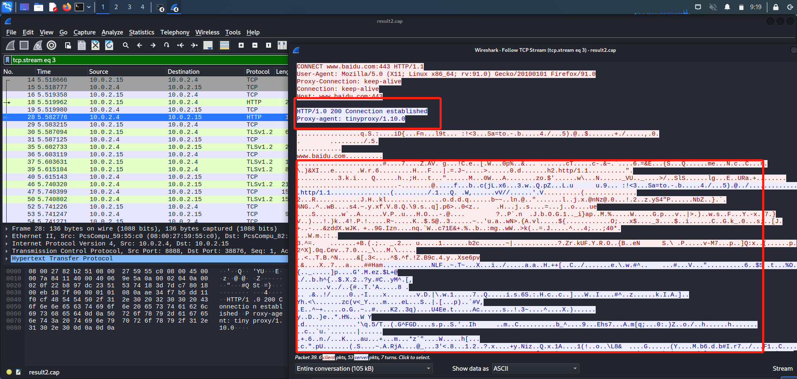<br/>

## 实验结论
1.通过代理服务器可以绕过某些访问限制，即攻击者本身不能访问靶机，通过代理服务器可以绕过访问限制，可以访问靶机；<br/>
2.代理服务器可以看到用户访问的网址；<br/>
3.代理服务器无法看到https通信数据，但仍有可能受中间人攻击。<br/>

## 实验中遇到的问题和解决
1.由于Debian界面太小不好操作，试图使用ssh登录出现权限问题。<br/>
解决方案：<br/>
```javascript
1.修改/etc/ssh/sshd_config配置文件
将#PermitRootLogin prohibit-password
修改为
PermitRootLogin yes2.
2.重启ssh即可
service sshd restart
```
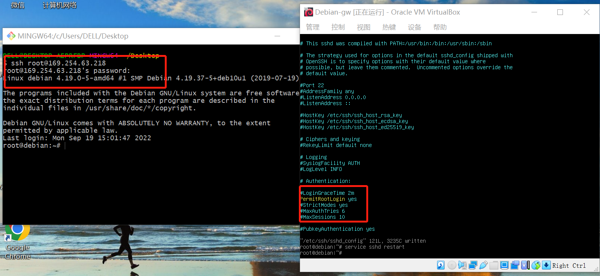<br/>
2.本来想在网关虚拟机和我的主机之间进行网关抓包文件的传输，但是一直出错，可能是主机防火墙之类的问题。<br/>
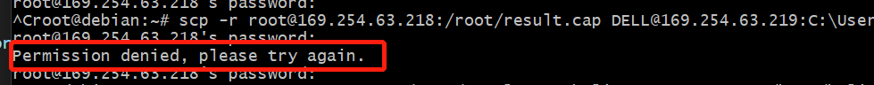<br/>
于是选择将网关的抓包结果传输给kali-victim，使用该主机上的wireshark进行抓包结果分析。在kali-victim主机上使用```scp -r root@172.16.111.1:/root/result.cap /home/kali/Desktop/```语句成功实现。<br/>

## 参考资料
[2021-ns-public-Lychee00/chap0x03/report03.md](https://github.com/CUCCS/2021-ns-public-Lychee00/blob/chap0x03/chap0x03/report03.md)<br/>
[2018-NS-Public-jckling/ns-0x03/3.md](https://github.com/CUCCS/2018-NS-Public-jckling/blob/master/ns-0x03/3.md)<br/>
[tcpdump 抓包命令使用教程](https://zhuanlan.zhihu.com/p/74812069)<br/>